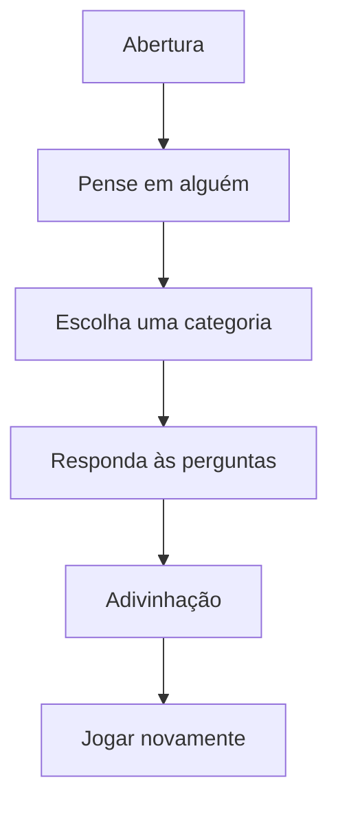

# Quem Sou Eu? — Onboarding da Primeira Partida

## Objetivo

Fazer a criança entender o jogo em menos de 30 segundos: ela pensa em uma pessoa, responde perguntas simples e o app tenta adivinhar quem é. O onboarding deve ser curto, visual, narrado pela princesa-detetive e poder ser pulado a qualquer momento.

> Promessa central: **“Pense em alguém. Eu vou tentar descobrir!”**

---

## Princípios da primeira experiência

- **Uma ação por tela:** nada de parágrafos longos ou instruções escondidas.
- **Aprender jogando:** a primeira rodada já é parte do tutorial; não usar uma aula separada.
- **Sem cadastro antes da diversão:** a criança começa a jogar imediatamente. Perfil, permissões e notificações ficam para depois de uma primeira vitória.
- **Linguagem acolhedora:** frases curtas, positivas e sem termos técnicos.
- **Reforço visual:** a princesa com lupa, nuvens, estrelas e o ponto de interrogação conduzem a jornada.
- **Autonomia:** botão discreto `Pular` em todas as telas de apresentação e `Sair da rodada` durante o jogo.

---

## Fluxo recomendado

---

## Telas do onboarding

### 1. Boas-vindas — a missão começa

**Objetivo:** apresentar a proposta em uma única frase.

**Visual**

- Fundo roxo profundo com nuvens fofas e brilhos suaves.
- Princesa-detetive em destaque, segurando a lupa sobre um grande `?`.
- Logo `QUEM SOU EU?` no topo.

**Texto**

> Olá! Eu sou a Princesa Detetive.  
> Pense em uma pessoa e eu tentarei descobrir quem é!

**Ações**

- Primária: `Começar`
- Secundária: `Pular explicação`

---

### 2. Escolha alguém em segredo

**Objetivo:** evitar a dúvida mais comum: o usuário deve pensar em uma pessoa antes das perguntas.

**Visual**

- Personagem em pose de segredo, com dedo nos lábios.
- Balão de pensamento contendo silhuetas variadas: artista, atleta, criador de conteúdo e personagem público.

**Texto**

> Escolha alguém na sua cabeça…  
> Mas não me conte ainda! 🤫

**Ação**

- `Já pensei em alguém`

**Regra de experiência**

Não pedir nome, foto ou qualquer dado da pessoa. A escolha acontece apenas na imaginação da criança.

---

### 3. Escolha o universo da rodada

**Objetivo:** tornar o jogo mais rápido e melhorar a qualidade das perguntas.

**Visual**

- Grade de cards grandes, coloridos e fáceis de tocar.
- Cada card tem ilustração própria e nome escrito em fonte arredondada.

**Categorias iniciais**

| Categoria | Uso na primeira partida |
| --- | --- |
| Influencers TikTok | Mais familiar e imediato para parte do público infantil/jovem. |
| Influencers Instagram | Para criadores conhecidos pela criança. |
| Futebol | Jogadores brasileiros e internacionais. |
| Artistas brasileiros | Cantores, atrizes, atores e apresentadores. |
| Personalidades mundiais | Pessoas reconhecidas fora do Brasil. |
| Todos | Rodada livre; apresentar como opção avançada. |

**Texto**

> Em que mundo está a sua pessoa?

**Ação**

- Toque em um card para iniciar a rodada.

**Sugestão de primeira seleção**

Destacar `Influencers TikTok` com selo `Mais divertido` sem bloquear as demais categorias.

---

### 4. Como responder às perguntas

**Objetivo:** ensinar as respostas e reduzir hesitação.

**Visual**

- Uma pergunta de exemplo em card: `A pessoa é brasileira?`
- Quatro botões grandes em uma linha ou grade 2×2.

**Texto**

> Vou fazer perguntas. Responda o que você achar mais certo!

**Botões de resposta**

| Botão | Quando usar |
| --- | --- |
| `Sim` | Você tem certeza que é verdade. |
| `Provavelmente` | Você acha que sim, mas não tem certeza. |
| `Não sei` | Você não conhece essa informação. |
| `Provavelmente não` | Você acha que não é verdade. |
| `Não` | Você tem certeza que não é verdade. |

**Importante**

Mostrar somente quatro opções por vez no layout compacto: `Sim`, `Provavelmente`, `Não sei` e `Não`. Ao tocar e segurar `Sim` ou `Não`, a pessoa pode escolher a versão `Provavelmente`. Isso mantém a tela simples e preserva precisão para quem quiser usar.

**Ação**

- `Entendi, pode perguntar!`

---

### 5. Primeira pergunta guiada

**Objetivo:** transformar a explicação em jogo de verdade.

**Visual**

- Indicador de progresso leve: `Pergunta 1` com pequenos pontos, sem mostrar uma quantidade rígida.
- Princesa-detetive animada no rodapé, como se estivesse pensando.

**Texto de apoio**

> Não existe resposta errada. Se tiver dúvida, toque em `Não sei`.

**Comportamento**

- Após a primeira resposta, ocultar as dicas longas.
- Manter apenas um ícone `?` no canto para reabrir a ajuda quando necessário.
- Usar microfeedback: estrela, som leve opcional e frase como `Boa pista!`.

---

### 6. Momento da adivinhação

**Objetivo:** criar surpresa, mesmo quando a tentativa não for correta.

**Visual**

- Animação curta da lupa percorrendo pistas.
- Card de revelação com retrato/ilustração da personalidade e fundo amarelo-ou roxo vibrante.

**Texto**

> Hmmm… já tenho um palpite!  
> Você pensou em **[Nome]**?

**Ações**

- `Acertou! 🎉`
- `Não foi dessa vez`

**Se acertar**

> Eu sabia! Vamos descobrir mais uma?

**Se errar**

> Quase! Cada resposta me ajuda a ficar mais esperta.

Não transformar o erro em punição. Não exibir pontuação negativa nem mensagens de frustração.

---

### 7. Encerramento da primeira experiência

**Objetivo:** levar naturalmente à próxima partida.

**Visual**

- Confetes, troféu/estrela e a princesa comemorando.
- Um card discreto de progresso: `Sua primeira investigação foi concluída!`

**Texto**

> Você já sabe jogar!  
> Escolha outra categoria ou tente me enganar de novo.

**Ações**

- Primária: `Jogar outra vez`
- Secundária: `Ver categorias`
- Terciária: `Ir para início`

---

## Ajuda rápida reutilizável

Disponível pelo ícone `?` durante qualquer partida:

1. Pense em uma pessoa da categoria escolhida.
2. Responda às perguntas com sinceridade.
3. Use `Não sei` quando estiver em dúvida.
4. Espere o palpite da Princesa Detetive.

Essa ajuda deve abrir em um modal curto, com ilustrações, sem tirar o progresso da rodada.

---

## Regras de negócio da primeira partida

- A primeira partida deve iniciar em até **dois toques** após a abertura do app.
- Cadastro, login, idade, notificações e permissões não podem bloquear o jogo.
- Salvar localmente a última categoria e o progresso da rodada em caso de fechamento acidental.
- Só mostrar pedido de avaliação depois de, no mínimo, **três partidas concluídas** e um momento positivo (por exemplo, após um acerto).
- Depois de duas rodadas, apresentar opcionalmente a área `Coleção de descobertas`/conquistas.
- O modo `Todos` não deve ser o padrão da primeira sessão: categorias menores deixam o jogo mais compreensível e a adivinhação mais confiável.

---

## Tom de voz

| Fazer | Evitar |
| --- | --- |
| “Boa pista!”, “Você está indo muito bem!”, “Vamos investigar?” | “Você errou”, “Resposta inválida”, “Tente novamente”. |
| Frases de até duas linhas | Instruções longas ou linguagem técnica. |
| Incentivar a curiosidade | Competição agressiva ou pressão por desempenho. |

---

## Checklist de implementação

- [ ] Onboarding com no máximo 4 telas antes da primeira pergunta real.
- [ ] Botão `Pular explicação` visível.
- [ ] Categoria escolhida antes do questionário.
- [ ] Opção `Não sei` sempre disponível.
- [ ] Ajuda acessível durante a partida.
- [ ] Resultado positivo tanto para acerto quanto para erro.
- [ ] Primeiro reengajamento focado em `Jogar outra vez`.

---

## Direção visual

Manter o universo já definido: roxo profundo como base, roxo vibrante, verde-limão, amarelo/ouro, rosa/magenta e azul como cores de energia. Usar tipografia forte e arredondada, cards com cantos de 18–28 px, sombras suaves e ícones com profundidade. A princesa-detetive e o símbolo `?` precisam aparecer como fios condutores, sem poluir as telas.
